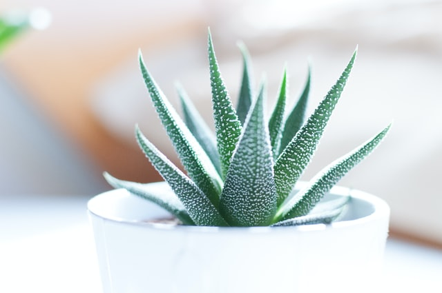

# Проект "Новости в мире кактусов"

Разработан в качестве практического задания на курсе **WEB-разработчик** лучшими каксологами г.Петрозаводска

Самые жаркие новости о красных, зелёных, жёлтых кактусах. И даже ***кактусах с цветочками***! 

Следите за новостями, если вам не безразличны кактусы!

## Используемые технологии

* HTML

* CSS 

* Всё

## Как открыть/запустить

Зайти в папку сайта в файловом менеджере, кликнуть 2 раза по файлу index.html (пока только так).